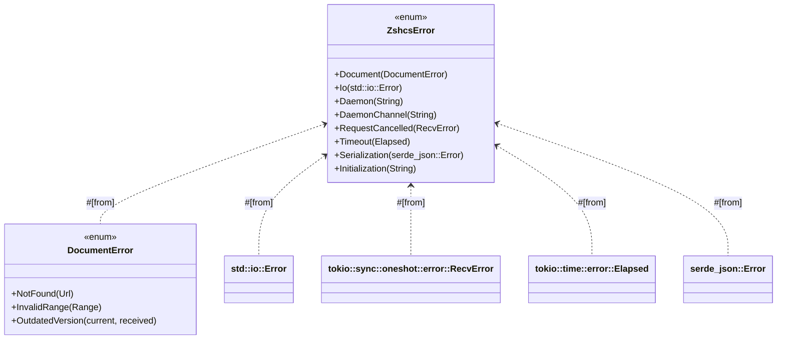
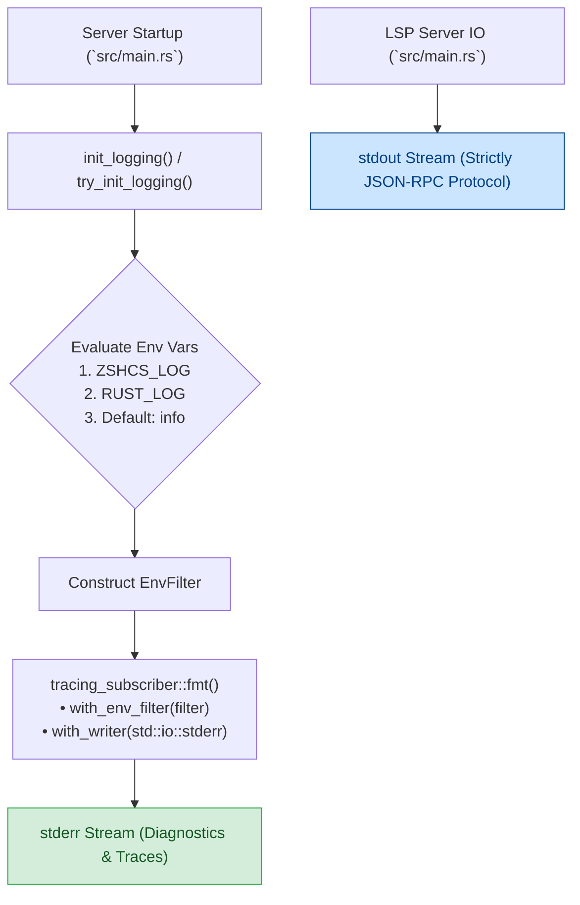
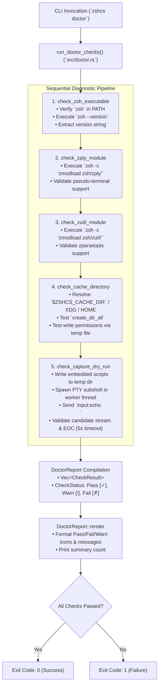
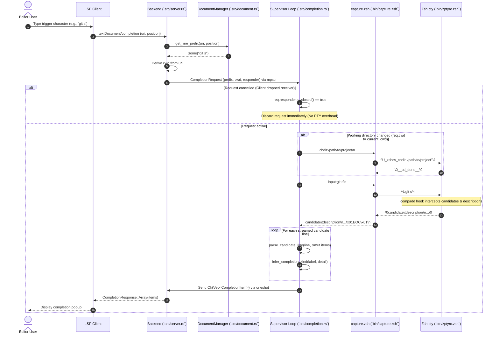

# Architecture

This document provides a comprehensive technical overview of the internal design, component architecture, inter-process communication protocols, error hierarchy, performance optimizations, and testing infrastructure of `zshcs` (Zsh Completion Server), a Language Server Protocol (LSP) implementation for the Zsh shell.

---

## 1. System Overview

`zshcs` is structured as a two-tier system consisting of a Rust-based LSP server and an embedded, persistent Zsh completion engine running inside an interactive pseudo-terminal (`zpty`).

```mermaid
flowchart TB
    subgraph ClientLayer [Client Layer]
        Editor["LSP Client (Editor / IDE)"]
    end

    subgraph RustServer [Rust LSP Server Process (zshcs)]
        LSPBackend["LSP Backend (`src/server.rs`)<br/>• LanguageServer Trait<br/>• Request Routing & Commands"]
        DocMgr["DocumentManager (`src/document.rs`)<br/>• In-Memory Arc&lt;DashMap&lt;Url, DocumentState&gt;&gt;<br/>• Incremental Sync & UTF-16/UTF-8 Mapping"]
        Supervisor["Daemon Supervisor (`src/completion.rs`)<br/>• run_completion_daemon<br/>• HoL Cancellation & Timeout Guard<br/>• Process Recovery & chdir Sync"]
        Logging["Logging Subsystem (`src/logging.rs`)<br/>• tracing & tracing-subscriber<br/>• Stderr Destination & EnvFilter"]
        ErrHandling["Error Hierarchy (`src/error.rs`)<br/>• ZshcsError / ZshcsResult<br/>• Type-Safe Conversions"]
    end

    subgraph ZshEngine [Embedded Zsh Completion Engine]
        CaptureScript["capture.zsh (`bin/capture.zsh`)<br/>• Persistent RPC Driver & stdin Loop<br/>• zpty PTY Controller"]
        ZptySubshell["Interactive Zsh Subshell (`zpty`)<br/>• zptyrc.zsh Configuration<br/>• compadd Interception Hook<br/>• Isolated Cache ($ZSHCS_CACHE_DIR)"]
    end

    Editor <-->|LSP JSON-RPC / stdio (stdout)| LSPBackend
    LSPBackend <-->|CRUD & Offset Conversion| DocMgr
    LSPBackend -->|mpsc / oneshot| Supervisor
    RustServer -.->|Structured Logs (stderr)| Editor
    Supervisor <-->|Piped stdin/stdout (RPC: input / chdir)| CaptureScript
    CaptureScript <-->|PTY (C-U / C-I / C-J / \0 Delimiters)| ZptySubshell
```

---

## 2. Core Components & Subsystems

### 2.1 CLI Interface & LSP Server Backend (`src/cli.rs`, `src/server.rs`, `src/lib.rs`, `src/main.rs`)

The entry point and server backend coordinate command-line argument parsing, LSP request routing, document lifecycle notifications, completion dispatching, and custom extension commands.

- **CLI Argument Parsing (`src/cli.rs`)**:
  - Employs `clap` (derive macro) to provide type-safe, declarative command-line parsing.
  - Supports standard flags: `--stdio` (default mode for stdio-based LSP communication), `--version` / `-V`, and `--help` / `-h`.
  - Supports the `doctor` subcommand (`zshcs doctor`) to inspect runtime prerequisites and environment health.
- **Capabilities Negotiation (`initialize`)**:
  - **Text Document Sync**: `TextDocumentSyncKind::INCREMENTAL` for fine-grained, low-latency diff synchronization.
  - **Trigger Characters**: Registers `["-", "$", "/", "~", ".", " "]` to trigger completions immediately upon typing flags, variables, directory paths, hidden files, or subcommands.
  - **Execute Command Provider**: Exposes custom command `zshcs/getDocumentContent` for internal document state inspection and integration testing.
- **Dual Initialization Pathways**:
  - **Synchronous Constructors**: `Backend::new`, `Backend::new_with_scripts`, and `Backend::new_with_scripts_and_cache` provide immediate synchronous setup using standard file I/O (`std::fs`).
  - **Non-Blocking Async Constructors**: `Backend::new_async`, `Backend::new_with_scripts_async`, and `Backend::new_with_scripts_and_cache_async` utilize `tokio::fs` to ensure script extraction and tempfile writes do not block Tokio runtime worker threads during startup.

---

### 2.2 Document Management (`src/document.rs`)

The `DocumentManager` subsystem maintains accurate in-memory representations of all active editor buffers.

- **Thread-Safe State Store**:
  - Encapsulates `Arc<DashMap<Url, DocumentState>>` to enable lock-free, concurrent read/write access across async tasks.
  - Decoupled entirely from the `tower-lsp::Server` actor to facilitate modular unit testing and independent state verification.
- **Document Lifecycle & Atomic Synchronization**:
  - `did_open` (`open`): Registers new documents with initial text and version.
  - `did_change` (`apply_changes`): Applies sequences of `TextDocumentContentChangeEvent` (both full replacements and incremental range updates).
  - **Version Monotonicity**: Verifies received versions against current state; rejects outdated changes with `DocumentError::OutdatedVersion`.
  - **Atomic Rollback Guarantee**: Validates all change ranges before applying mutations. If any change specifies an invalid range (`DocumentError::InvalidRange`), the document state remains untouched.
  - `did_close` (`close`): Safely deletes document entries from the map, immediately freeing allocated memory when files are closed in the client.
- **UTF-16 Character Position to UTF-8 Byte Offset Mapping (`position_to_byte_offset`)**:
  - Converts LSP 0-based UTF-16 line/character coordinates to Rust UTF-8 byte indices.
  - Handles multibyte characters (CJK ideographs, 4-byte SMP characters such as `𩸽`), Unicode surrogate pairs, complex emoji sequences (skin tone modifiers, ZWJ sequences like `👨‍👩‍👧‍👦`, regional indicator flags `🇯🇵`), and combining diacritical marks.
  - Safely normalizes LF (`\n`), CRLF (`\r\n`), and mixed line endings without out-of-bounds panics.

---

### 2.3 Completion Daemon Architecture & Supervisor (`src/completion.rs`)

The completion engine runs as an actor managed by a dedicated supervisor loop (`run_completion_daemon`).

```mermaid
flowchart TD
    Start([Spawn Supervisor Loop]) --> WaitReq[Wait for CompletionRequest from Channel]
    WaitReq --> CheckCancel{req.responder<br/>.is_closed()?}
    
    CheckCancel -- Yes (Client Dropped) --> DropReq[Discard Request Immediately] --> WaitReq
    CheckCancel -- No (Active Request) --> CheckAlive{proc == None or<br/>!proc.is_alive()?}
    
    CheckAlive -- Process Dead / None --> SpawnProc[Spawn DaemonProcess via tokio::process]
    SpawnProc -- Spawn Error --> ReportSpawnErr[Send IoError to Responder] --> WaitReq
    SpawnProc -- Success --> CheckCwd
    CheckAlive -- Process Alive --> CheckCwd
    
    CheckCwd{req.cwd !=<br/>proc.current_cwd?}
    CheckCwd -- Yes (Directory Changed) --> SendChdir["Send chdir:&lt;sanitized_cwd&gt;\\n<br/>(capture.zsh syncs pty cwd)"] --> SendInput
    CheckCwd -- No (Same Directory) --> SendInput
    
    SendInput["Send input:&lt;sanitized_prefix&gt;\\n"] --> ReadStream[Read stdout stream with 5000ms timeout]
    
    ReadStream --> CheckLine{Stream Line Type}
    CheckLine -- Candidate Record --> ParseCandidate[parse_candidate_line & infer_completion_kind] --> ReadStream
    CheckLine -- End-of-Completion (\\x01EOC\\x01) --> SendSuccess[Send Ok(Vec&lt;CompletionItem&gt;) via oneshot] --> WaitReq
    
    ReadStream -- Timeout (> 5000ms) --> KillHung[proc.child.start_kill & proc = None] --> ReportTimeout[Send Daemon Timeout Err] --> WaitReq
    ReadStream -- I/O Failure / EOF --> KillDead[proc.child.start_kill & proc = None] --> ReportIOErr[Send IoError to Responder] --> WaitReq
```

- **Supervisor Pattern & Self-Healing**:
  - Automatically verifies process health via `proc.is_alive()` (`child.try_wait()`) before processing each request.
  - If the child process has terminated or crashed, the supervisor logs a warning and transparently spawns a replacement `DaemonProcess`.
- **Request Timeout Guard (`DAEMON_REQUEST_TIMEOUT = 5000ms`)**:
  - Wraps request processing in `tokio::time::timeout`.
  - If a Zsh completion function hangs (e.g. infinite loop in user-defined completion scripts), the supervisor terminates the hung child process via `child.start_kill()`, purges the handle, and returns an error without stalling the server.
- **Working Directory Synchronization Protocol (`chdir:<path>`)**:
  - Tracks `current_cwd` in `DaemonProcess`.
  - When a completion request arrives with a target directory derived from the document URI (`file://...`), the supervisor checks whether `current_cwd` matches the target.
  - If synchronization is required, the supervisor transmits `chdir:<sanitized_cwd>\n` to the daemon stdin.
  - The `capture.zsh` script invokes `_zshcs_chdir` in the pty subshell and consumes the null-byte delimited acknowledgement `\0__cd_done__\0`, ensuring subsequent path-relative completions resolve accurately without corrupting the candidate stdout stream.
- **Asynchronous Stderr Monitoring**:
  - Spawns a dedicated background task reading the daemon's `stderr` stream line-by-line via `BufReader`.
  - Forwards diagnostic and warning output to the LSP client via `window/logMessage` (`MessageType::WARNING`) without blocking completion data on `stdout`.

---

### 2.4 Zsh Completion Engine (`bin/capture.zsh`, `bin/zptyrc.zsh`)

The completion engine integrates directly with Zsh's programmable completion system (`compinit`).

- **Compile-Time Embedding**:
  - `bin/capture.zsh` and `bin/zptyrc.zsh` are embedded into the compiled binary via `include_str!`.
  - At server initialization, these scripts are written into a dedicated temporary directory.
- **Isolated Cache Management (`ZSHCS_CACHE_DIR`)**:
  - Directs `compinit` dump files to `$ZSHCS_CACHE_DIR/compdump` (defaulting to `$XDG_CACHE_HOME/zshcs/zsh` or `$HOME/.cache/zshcs/zsh`).
  - Guarantees zero pollution of the user's personal `~/.zcompdump` or shell configuration.
- **Interactive Pseudo-Terminal Simulation (`zsh/zpty`)**:
  - `capture.zsh` loads `zmodload zsh/zpty` and initializes a non-blocking interactive session: `zpty -b z zsh --no-rcs --interactive`.
  - Configures clean terminal options (`HISTSIZE=0`, `unset HISTFILE`, `unsetopt beep`, `setopt ignore_eof`, `setopt single_line_zle`).
  - Binds key codes for remote execution: `^U` (kill buffer), `^I` (complete word), `^J` (accept line).
- **`compadd` Interception Hook**:
  - Overrides the `compadd` builtin in `zptyrc.zsh`.
  - Directly delegates builtins when `-O`, `-A`, or `-D` flags are present (`builtin compadd "$@"`).
  - Intercepts completion candidate generation by injecting `-A __hits` and capturing descriptions with `-D __dscr`.
  - Extracts prefixes and suffixes using `zparseopts -E P:=apre p:=hpre S:=asuf s:=hsuf`.
  - Appends directory indicators (`/`) where appropriate.
  - Outputs matching candidates in tab-delimited format: `candidate\tdescription`.
  - Wraps pty output between null bytes (`\0`) and terminates the stream with the End-of-Completion token `\x01EOC\x01\n`.

---

### 2.5 Error Handling Subsystem (`src/error.rs`)

`zshcs` provides a centralized, type-safe error hierarchy implemented using `thiserror`.



- **Type-Safe Domain Errors**:
  - `ZshcsError::Document`: Wraps `DocumentError` for missing documents, invalid replacement ranges, and outdated version conflicts.
  - `ZshcsError::Io`: Captures standard I/O errors occurring during process management, script writes, and stream reads.
  - `ZshcsError::Daemon`: Captures daemon internal errors, timeouts, or unexpected termination.
  - `ZshcsError::DaemonChannel`: Dispatched when the mpsc channel to the completion daemon is closed or full.
  - `ZshcsError::RequestCancelled`: Triggered when an LSP completion request is cancelled and the oneshot responder drops.
  - `ZshcsError::Timeout`: Captures elapsed timeouts from async operations.
  - `ZshcsError::Serialization`: Handles JSON-RPC argument parsing failures.
  - `ZshcsError::Initialization`: Encapsulates startup or environment configuration failures.
- **Ergonomic Aliases**: Standard `pub type ZshcsResult<T> = Result<T, ZshcsError>` used throughout the library codebase.

---

### 2.6 Performance & UX Optimizations

`zshcs` incorporates several latency and throughput optimizations designed for smooth interactive editing:

1. **Head-of-Line (HoL) Blocking Elimination via Cancellation Checks**:
   - Fast typing generates rapid completion requests. When the LSP client drops older requests, their `oneshot::Receiver` is dropped.
   - The supervisor checks `req.responder.is_closed()` before sending commands to `capture.zsh`. Cancelled requests are discarded in $O(1)$ time without executing expensive pty operations.
2. **Zero-Allocation Stream Parsing (`parse_candidate_line`)**:
   - `parse_candidate_line` accepts a mutable reference to an existing `Vec<CompletionItem>` (`&mut Vec<CompletionItem>`), reusing vector allocations across streamed lines.
   - Splits candidate lines using zero-allocation `split_once('\t')`.
3. **Responsive LSP Trigger Characters**:
   - Automatically invokes completion on `-`, `$`, `/`, `~`, `.`, and ` ` without requiring manual `Ctrl+Space` triggers.
4. **Dynamic `CompletionItemKind` Inference (`infer_completion_kind`)**:
   - Analyzes candidate prefixes and descriptions to assign semantic LSP icon kinds:
     - `CompletionItemKind::KEYWORD`: Options and flags (`-v`, `--help`, `-o:fmt`, `--flag=val`, or descriptions containing "option"/"flag").
     - `CompletionItemKind::VARIABLE`: Environment variables and parameters (`$HOME`, `${VAR}`, or descriptions containing "variable"/"parameter"/"env").
     - `CompletionItemKind::FOLDER`: Directory paths (`.`, `..`, `~`, trailing `/`, paths with `/`, or descriptions containing "directory"/"folder").
     - `CompletionItemKind::FILE`: Files (`.zshrc`, `file.txt`, `archive.tar.gz`, or descriptions containing "file"/"archive").
     - `CompletionItemKind::FUNCTION`: Commands, builtins, functions, and aliases (descriptions containing "command", "builtin", "function", "alias", "executable").
     - `CompletionItemKind::TEXT`: General text fallback.

---

### 2.7 Logging & Observability Subsystem (`src/logging.rs`)

`zshcs` integrates a structured, high-performance logging subsystem built on `tracing` and `tracing-subscriber`.



- **Strict I/O Stream Segregation**:
  - The LSP specification mandates that `stdio`-based servers exchange standard JSON-RPC framing over `stdout`. Any non-protocol bytes written to `stdout` corrupt client parsing and break editor integration.
  - `zshcs` strictly routes all logging subscribers to `std::io::stderr` via `.with_writer(std::io::stderr)`.
- **Dynamic Log Filtering (`create_env_filter`)**:
  - Automatically parses log level directives from the environment with cascading precedence:
    1. `ZSHCS_LOG` (dedicated application-level override, e.g., `ZSHCS_LOG=debug` or `ZSHCS_LOG=zshcs=trace`).
    2. `RUST_LOG` (standard Rust ecosystem variable, e.g., `RUST_LOG=info`).
    3. `info` (fallback default providing essential operational milestones without verbose noise).
- **Idempotent & Test-Safe Initialization**:
  - `init_logging()` wraps `try_init_logging()` to ensure safe multi-threaded test runs and repeated invocations without panics.
- **Deep Instrumentation Coverage**:
  - **Server Lifecycle**: `initialize` (negotiated client capabilities), `initialized`, and `shutdown`.
  - **Buffer Synchronization**: `did_open`, `did_change` (tracks change counts and invalid ranges), `did_close`.
  - **Completion Pipeline**: Request dispatching, cwd synchronization (`chdir`), response times, candidate counts, and cancellation discards.
  - **Daemon Supervisor**: Child process spawning, stdout/stderr background streaming, crash recovery, and hung daemon timeout terminations (>5000ms).

---

### 2.8 Diagnostic Health Check Subsystem (`src/doctor.rs`, `zshcs doctor`)

`zshcs` provides a dedicated diagnostic command (`zshcs doctor`) designed to verify runtime prerequisites, shell modules, filesystem permissions, and completion engine integrity prior to LSP client integration.



- **Diagnostic Scope & Methodology**:
  1. **Zsh Executable Verification (`check_zsh_executable`)**:
     - Confirms `zsh` binary exists in the system `PATH` and is executable.
     - Executes `zsh --version` and records the reported shell version.
  2. **PTY Module Availability (`check_zpty_module`)**:
     - Executes `zsh -c "zmodload zsh/zpty"` to verify dynamic module loading of `zsh/zpty`.
     - Ensures the host environment can spawn interactive pseudo-terminals required by `capture.zsh`.
  3. **Utility Module Availability (`check_zutil_module`)**:
     - Executes `zsh -c "zmodload zsh/zutil"` to verify availability of `zparseopts` used for option/flag parsing in `zptyrc.zsh`.
  4. **Isolated Cache Verification (`check_cache_directory`)**:
     - Resolves the target cache directory with standard fallback hierarchy: `$ZSHCS_CACHE_DIR` $\to$ `$XDG_CACHE_HOME/zshcs/zsh` $\to$ `$HOME/.cache/zshcs/zsh` $\to$ temporary directory.
     - Verifies directory creation (`std::fs::create_dir_all`) and write permissions by writing and deleting a timestamped probe file.
  5. **Completion Engine Dry-Run (`check_capture_dry_run`)**:
     - Writes compile-time embedded `CAPTURE_ZSH` and `ZPTYRC_ZSH` to a temporary directory.
     - Spawns the interactive `capture.zsh` process in an isolated worker thread guarded by a 5-second timeout.
     - Submits a test completion query (`input:echo \n`), consumes the candidate stream, verifies reception of the `\x01EOC\x01` marker, and cleanly tears down the child process.
- **Reporting & Exit Code Semantics**:
  - `DoctorReport` structures outcomes across `CheckStatus::Pass` (`[✓]`), `CheckStatus::Warn` (`[!]`), and `CheckStatus::Fail` (`[✗]`).
  - Outputs a clear, formatted summary to standard output.
  - Returns exit code `0` when all mandatory diagnostic checks pass, and exit code `1` if any check fails, allowing seamless integration into installation scripts and CI verification.

---

## 3. Detailed Data Flow & Protocols

### 3.1 Completion Request Lifecycle



---

## 4. Testing, QA & Quality Gates

`zshcs` enforces quality assurance through a multi-tier testing and verification architecture:

```mermaid
flowchart LR
    subgraph PreCommit [Local Pre-Commit Gate (.githooks/pre-commit)]
        FMT["cargo fmt --check"]
        CLIPPY["cargo clippy (-D warnings)"]
        BUILD["cargo build"]
        RUST_TEST["cargo test --all-targets"]
        ZSH_TEST["zsh tests/zsh/run_tests.zsh"]
    end

    subgraph CI [GitHub Actions CI Pipeline (.github/workflows/ci.yml)]
        MATRIX["Matrix Builds (Ubuntu & macOS)"]
        COV["cargo-llvm-cov"]
        OCTOCOV["Octocov Quality Gate (>=85% Coverage)"]
    end

    subgraph Benchmarks [Performance Benchmarks (benches/)]
        CRITERION["Criterion Benchmarks<br/>• parse_candidate_line (1k batch)<br/>• infer_completion_kind<br/>• position_to_byte_offset<br/>• apply_changes"]
    end

    FMT --> CLIPPY --> BUILD --> RUST_TEST --> ZSH_TEST
    ZSH_TEST --> MATRIX --> COV --> OCTOCOV
```

### 4.1 Test Suites Overview

1. **Rust Integration & Unit Test Suites**:
   - `tests/completion_test.rs` (37 tests): Validates LSP completions, consecutive requests, dynamic item kinds, working directory switching, crash recovery, timeout handling, and CRLF / multibyte buffers.
   - `tests/server_test.rs` (34 tests): Tests initialize handshake, capabilities negotiation, incremental synchronization, out-of-order versions, invalid ranges, document close cleanup, and custom execution commands.
   - `tests/logging_test.rs` (8 tests): Validates tracing subscriber initialization, `stderr` log routing, stdout JSON-RPC isolation, and dynamic `ZSHCS_LOG` / `RUST_LOG` filter evaluation.
   - `tests/cli_test.rs` (22 tests): Validates CLI flag parsing (`--stdio`, `--help`, `--version`), doctor subcommand parsing, duplicate detection, and process lifecycle over stdio.
   - `tests/doctor_test.rs` (22 tests): Validates the `doctor` health check subsystem, individual diagnostic checks (Zsh executable, zpty, zutil, cache dir permissions, capture dry-run), report formatting, and exit codes.
   - `tests/stress_test.rs` (20 tests): High-concurrency stress testing with 50 simultaneous clients, 10,000-candidate volume parsing, channel saturation, rapid interleaved edit/completion bursts, and deterministic PRNG fuzzing for Unicode boundaries and surrogate pairs.
2. **Zsh Script Unit Test Harness (`tests/zsh/run_tests.zsh`)**:
   - Executes 12 standalone unit test cases validating `capture.zsh` and `zptyrc.zsh` syntax (`zsh -n`), module loading (`zsh/zpty`, `zsh/zutil`), isolated cache creation, directory synchronization helpers (`_zshcs_chdir`), `compadd` delegation and interception hooks, and pty end-to-end query processing.
3. **Statistical Performance Benchmarking (`benches/parser_benchmark.rs`)**:
   - Employs Criterion to measure throughput and microsecond latency for candidate line parsing (single-line and 1,000-candidate batches), `infer_completion_kind` classification, UTF-16/UTF-8 offset conversions, and incremental document state updates.
4. **Pre-Commit Hook & CI Enforcement**:
   - Git native pre-commit hook (`.githooks/pre-commit`) configured via `git config core.hooksPath .githooks`.
   - CI pipeline (`.github/workflows/ci.yml`) enforces zero warnings on Linux and macOS, accompanied by `cargo-llvm-cov` and an Octocov 85% code coverage threshold gate.
